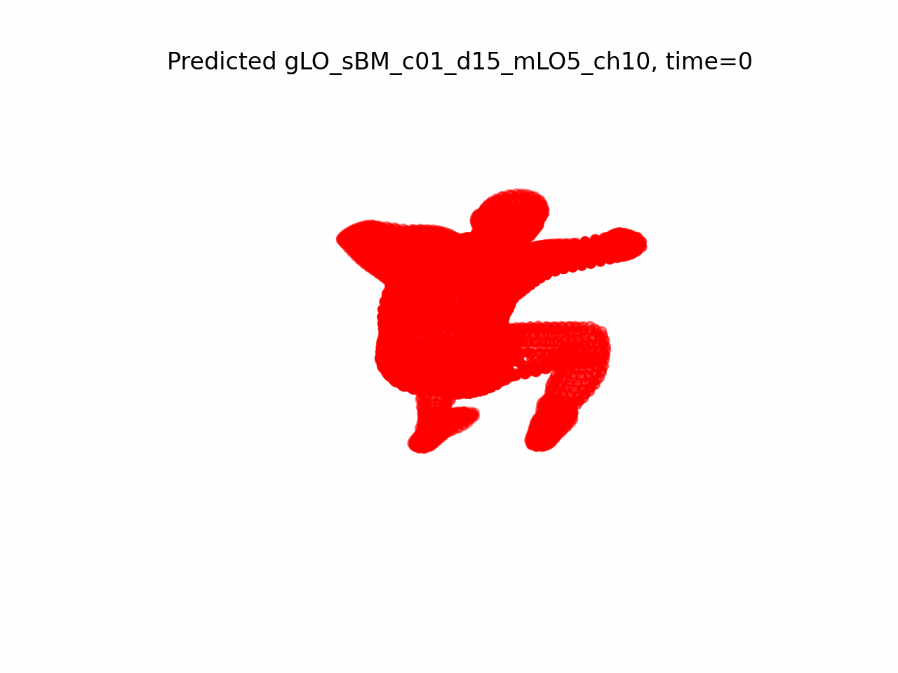
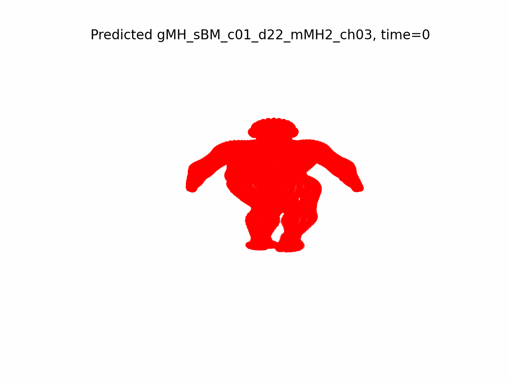
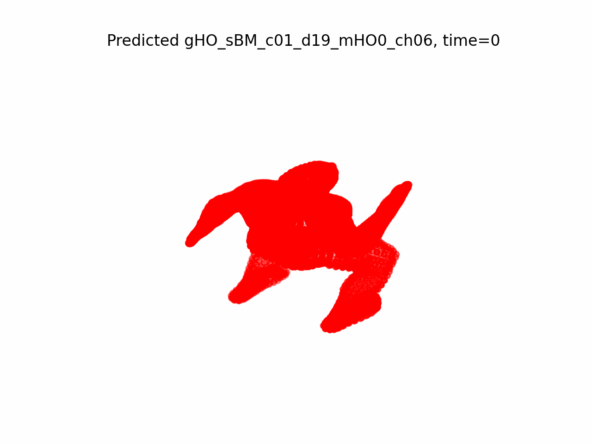
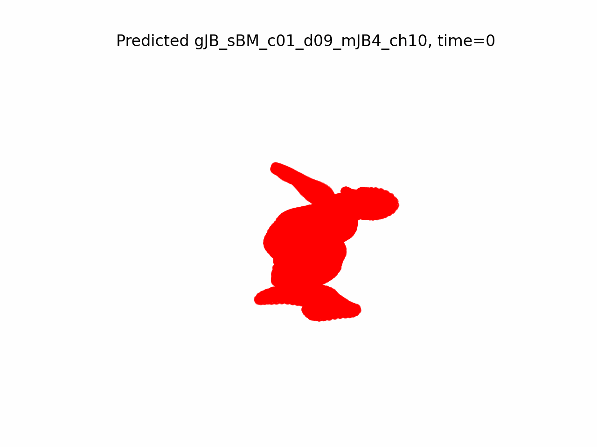

# Music Conditioned Efficient Dance Motion Prediction
### Work done as a project for CS 598 Efficient and predictive vision

 **Project team** - Shubhang Bhatnagar, Eashan Gupta, Sahil agarwal

**Abstract** -    *In this project, we use GCNs to train a model that uses previous human dance poses and a complete music to predict the future poses of the human for the rest of the music. We improve upon the the STSGCNs from prior work to propose ASTS GCNs that can be used to model multi-modal inputs - human motion and music. These modified GCNs are used in our model trained on the AIST++ dataset and provide quantitative as well as qualitative results.*


 ### Install dependencies:
```
 $ pip install -r requirements.txt
```

 ### Get the preprocessed data from the AIST++ project page

Just outside the code folder, form a data directory structure:
```shell script
data
|-- tf_sstables
```

### Convert the data into pytorch readable format by running the script
```
 python preprocessing.py
```


### Train
The arguments for running the code are defined in [parser.py](utils/parser.py). We have used the following commands for training the network with different prediction modules -

CNN based prediction -
```bash
python3 main_aist_cnn.py --n_epochs=40 --step_size=5 --output_step_size=2 --input_n=20 --output_n=10 --batch_size=256 --music_as_joint=6 --n_tcnn_layers=1 --lr=0.01 --milestones=[2,4,6,8]
 ```

LSTM based prediction
```bash
 python3 main_aist_music_lstm.py --n_epochs=40 --step_size=5 --output_step_size=2 --input_n=10 --output_n=10 --batch_size=32 --music_as_joint=12 --n_tcnn_layers=1 --lr=0.01 --milestones=[2,4,6,8]
  ```
### Results
A few visualizations of the predicted dance motions by our model are  -




 ### Acknowledgments

 Our code was built and adapted from the official [STSGCN](https://github.com/FraLuca/STSGCN) and [AIST++](https://github.com/google-research/mint) repositories.


 ### License

 MIT license
